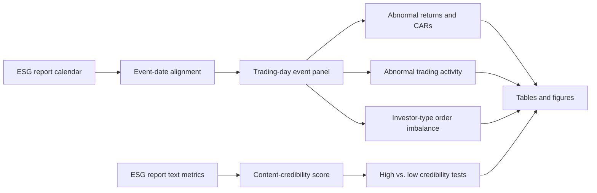

<p align="center">
  
</p>

<h1 align="center">Mandate-Backed ESG Reporting and Limited Price Discovery</h1>
<h3 align="center">Evidence from Sustainability Report Releases on the Abu Dhabi Securities Exchange</h3>

<p align="center">
  <a href="https://doi.org/10.5281/zenodo.20371869"></a>
  <a href="https://orcid.org/0000-0002-1670-8033"></a>
  
  
  
</p>

## Citation

**Drakopoulou, V.** (2026). *Mandate-backed ESG reporting and limited price discovery: Evidence from sustainability report releases on the Abu Dhabi Securities Exchange* [Replication package]. Zenodo. https://doi.org/10.5281/zenodo.20371869

**Author:** Veliota Drakopoulou  
**Affiliations:** Higher Colleges of Technology, United Arab Emirates; Embry-Riddle Aeronautical University, United States  
**ORCID:** [0000-0002-1670-8033](https://orcid.org/0000-0002-1670-8033)  
**Email:** [vdrakopoulou@gmail.com](mailto:vdrakopoulou@gmail.com)  
**GitHub:** <https://github.com/vdrakopoulou/ADX-ESG-Reporting-Event-Study-Replication-Package/tree/main>  
**Zenodo DOI:** <https://doi.org/10.5281/zenodo.20371869>

---

## Project overview

This repository reproduces the empirical analysis for the paper:

> **Mandate-Backed ESG Reporting and Limited Price Discovery: Evidence from Sustainability Report Releases on the Abu Dhabi Securities Exchange**

The study asks whether ESG and sustainability report releases generate market reactions on the Abu Dhabi Securities Exchange (ADX). It uses an event-study design to test abnormal returns, abnormal trading activity, and investor-type order imbalance around ESG report publication dates.

The central finding is intentionally conservative:

> ESG report publication on ADX does not generate significant immediate abnormal returns or abnormal trading volume. Investor-type trading shows wider-window rebalancing, especially when ESG report content is more credible, but these flow results are interpreted as gradual rebalancing rather than clean announcement-day causality.

---

## At a glance

| Component | Description |
|---|---|
| Broad ESG report universe | Approximately 101 ADX-listed firms, representing nearly the full actively traded ADX equity universe used in the project |
| Final event-study sample | 67 aligned ESG report-release events |
| Event-panel observations | 1,388 firm-event-trading-day observations |
| Content-credibility subsample | 51 matched report-release events |
| Main outcomes | CARs, abnormal log value traded, Company/Corporate OI, Individual OI |
| Main conclusion | Limited price discovery; suggestive wider-window investor-type rebalancing |
| Repository purpose | Reproducibility, auditability, and transparent empirical workflow |

---

## Research design



Event day 0 is defined as the first trading day on or after the ESG report announcement date. The main windows are `[-1,+1]`, `[-3,+3]`, `[-5,+5]`, and `[-10,+10]`.

---

## Repository structure

```text
ADX-ESG-Reporting-Event-Study-Replication-Package/
|
|-- README.md
|-- CITATION.cff
|-- .zenodo.json
|-- LICENSE
|-- DATA_AVAILABILITY.md
|-- CHANGELOG.md
|-- requirements.txt
|-- RUN_REPLICATION.py
|-- RUN_CONTENT_HETEROGENEITY.py
|
|-- code/
|   |-- paper1_publishable_event_tests_v2.py
|   |-- paper1_content_credibility_heterogeneity.py
|
|-- data/
|   |-- event_calendar/
|   |-- raw/
|   |-- templates/
|
|-- outputs/
|   |-- main_event_study/
|   |-- content_credibility/
|
|-- selected_figures/
|-- manuscript/
|-- documentation/
|-- logs/
|-- assets/
```

The repository is designed so that the main event-study results and content-credibility heterogeneity results can be reproduced separately.

---

## Quick start

### 1. Clone the repository

```bash
git clone https://github.com/vdrakopoulou/ADX-ESG-Reporting-Event-Study-Replication-Package.git
cd ADX-ESG-Reporting-Event-Study-Replication-Package
```

### 2. Create an environment

```bash
python -m venv .venv
source .venv/bin/activate     # macOS/Linux
# .venv\Scripts\activate      # Windows
```

### 3. Install requirements

```bash
pip install -r requirements.txt
```

### 4. Reproduce the main event-study results

```bash
python RUN_REPLICATION.py
```

### 5. Reproduce the content-credibility heterogeneity tests

```bash
python RUN_CONTENT_HETEROGENEITY.py
```

Reproduced files are written to:

```text
outputs_reproduced/main_event_study/
outputs_reproduced/content_credibility/
```

---

## Main outputs

| Output | File |
|---|---|
| Sample construction | `outputs/main_event_study/tables/sample_construction.csv` |
| Event-window tests | `outputs/main_event_study/tables/event_window_tests_all_robustness.csv` |
| Placebo tests | `outputs/main_event_study/tables/placebo_empirical_pvalues.csv` |
| Event-time regressions | `outputs/main_event_study/tables/event_time_regressions.csv` |
| Content-credibility tests | `outputs/content_credibility/tables/table_content_credibility_high_low.csv` |
| Abnormal-return figure | `outputs/main_event_study/figures/figure_abret_mktadj.png` |
| Investor-flow figures | `outputs/main_event_study/figures/figure_ab_oi_company.png`, `figure_ab_oi_individual.png` |

---

## Main empirical interpretation

The replication package supports three core findings:

1. **Limited price discovery.** ESG report releases do not generate significant short-window abnormal returns.
2. **Limited abnormal trading volume.** Report publication does not generate broad abnormal trading activity.
3. **Suggestive investor-type rebalancing.** Individual accounts become net buyers and Company/Corporate accounts become net sellers over wider windows, especially for more credible ESG reports. This is interpreted as gradual rebalancing rather than clean announcement-day causality.

The term **Company** follows the investor-type category in the ADX trading data. In the manuscript, it is interpreted as corporate or legal-entity accounts, not necessarily institutional investors, issuer-related accounts, insider trading, or market-maker activity unless separately identified.

---

## Data availability and restrictions

The repository includes scripts, metadata, event calendars, derived outputs, and documentation needed to reproduce the reported analysis. Raw market microstructure data and investor-type trading records may be subject to provider or exchange access restrictions. Where raw data cannot be redistributed, the repository includes templates, derived files, and documentation sufficient for researchers with comparable access to reproduce the workflow.

See [`DATA_AVAILABILITY.md`](DATA_AVAILABILITY.md) for details.

---

## Limitations

The results should be interpreted with two important limitations:

- **Small-sample statistical power.** The final event-study sample contains 67 aligned events, so small market reactions may remain difficult to detect.
- **Possible confounding news in wider windows.** Wider-window order-imbalance effects may be affected by overlapping firm-specific news, liquidity cycles, or broader trading conditions. Placebo tests, shifted windows, liquidity checks, and confounder flags reduce this concern but do not eliminate it.

---

## Keywords

ESG disclosure; sustainability reporting; event study; abnormal returns; investor order imbalance; disclosure credibility; Abu Dhabi Securities Exchange; ADX; UAE; emerging markets; signaling theory; market reaction

---

## How to cite this repository

Please cite both the paper and the replication package:

```bibtex
@misc{drakopoulou2026adx_esg_replication,
  author       = {Drakopoulou, Veliota},
  title        = {Mandate-Backed ESG Reporting and Limited Price Discovery: Evidence from Sustainability Report Releases on the Abu Dhabi Securities Exchange},
  year         = {2026},
  publisher    = {Zenodo},
  doi          = {10.5281/zenodo.20371869},
  url          = {https://doi.org/10.5281/zenodo.20371869}
}
```

---

## License

Code is released under the MIT License. Documentation and manuscript-related text are released under CC BY 4.0 unless otherwise stated. Data files derived from ADX or third-party sources may be subject to their original data-provider restrictions.


